# 🚨 SECURITY FIRST: API Keys & Secrets

## Never commit API keys, passwords, tokens, or other secrets to GitHub.

SmartPantry AI uses external services and APIs. Some of these services require private API keys. These keys must NEVER be placed directly in Python files or committed to the repository.

### ✅ Safe

Store private keys locally in a `.env` file:

OPENAI_API_KEY=your_private_key_here

The `.env` file must be included in `.gitignore` so Git does not track it.

Use `.env.example` to show teammates which variables they need:

OPENAI_API_KEY=

The `.env.example` file may be committed because it contains variable names only, NOT real secret values.

### ❌ Never Do This

Do not place a real key directly in code:

OPENAI_API_KEY = "sk-your-real-key"

Do not:

- Commit a `.env` file containing real keys.

- Paste API keys into Python files.

- Put keys in README files or documentation.

- Share API keys in GitHub issues or pull requests.

- Upload screenshots that reveal API keys.

## 🚨 If a secret is accidentally committed or pushed

STOP.

Do not assume deleting the key from the file fixes the problem. Git may preserve the secret in commit history.

1. Tell the team immediately.

2. Revoke or rotate the exposed key with the API provider.

3. Replace the compromised key with a new one.

4. Make sure the secret is removed from the repository.

5. Verify `.gitignore` is protecting the appropriate secret files before continuing.

When in doubt, DO NOT COMMIT. Ask the team first.

---

# 🌿 SmartPantry AI GitHub Workflow

This guide shows SmartPantry AI team members how to safely work in the shared GitHub repository.

The basic workflow is:

**Start on main → Sync → Create a branch → Make changes → Review → Commit → Push → Pull Request → Review → Merge → Clean up**

---

## 1. Golden Rule: Never Work Directly on `main`

The `main` branch is the shared, stable version of the SmartPantry AI project.

Do not make project changes directly on `main`.

For every new task:

1. Start from an updated `main`.
2. Create a new branch for your task.
3. Make your changes on that branch.
4. Use a Pull Request to merge the completed work back into `main`.

Examples of task branches:

- `feature/recipe-recommendations`
- `feature/barcode-product-data`
- `feature/expiration-tracking`
- `feature/recall-checker`
- `fix/recipe-scoring`
- `docs/background-research`

> ⚠️ **If GitHub Desktop says your Current Branch is `main`, do not start editing project files until you create or switch to your task branch.**

---

## 2. Start Every Work Session by Syncing `main`

Before starting a new task, make sure your computer has the latest version of the SmartPantry AI project.

### Step 1: Switch to `main`

In GitHub Desktop:

1. Confirm the **Current repository** is `smartpantry-ai`.
2. Click **Current branch**.
3. Select `main`.

### Step 2: Click `Fetch origin`

With `main` selected, click **Fetch origin** at the top of GitHub Desktop.

`Fetch origin` checks GitHub to see whether another team member has added new changes.

### Step 3: Look for `Pull origin`

After fetching:

- If the button continues to say **Fetch origin**, your local `main` is already up to date.
- If **Pull origin** appears, click it before creating your new branch.

**Fetch = Check GitHub for updates**

**Pull = Bring those updates onto your computer**

> ⚠️ **Do not create your new branch from an outdated `main`. Always Fetch and, if necessary, Pull first.**

### ✅ Clean Starting Point

When `main` is synchronized and you have no unfinished local work, GitHub Desktop should show `main`, `0 changed files`, and `Fetch origin`.

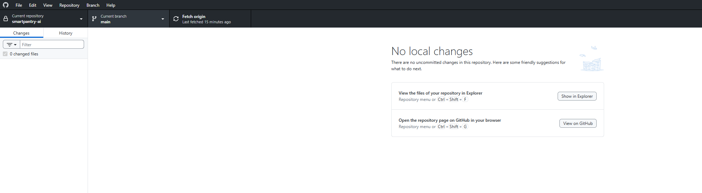

---

## 3. Create a Branch for Your Task

After syncing `main`, create a new branch before making any project changes.

A branch gives you a separate workspace where you can work without changing the shared `main` branch.

### Step 1: Create the Branch

In GitHub Desktop:

1. Make sure you are currently on `main`.
2. Click **Current branch**.
3. Click **New branch**.
4. Enter a descriptive branch name.
5. Create the branch.

Use a name that tells the team what you are working on.

Examples:

- `feature/recipe-recommendations`
- `feature/barcode-product-data`
- `feature/expiration-tracking`
- `feature/recall-checker`
- `fix/recipe-scoring`
- `docs/background-research`

### Step 2: Confirm You Are on the New Branch

After creating it, look at **Current branch** at the top of GitHub Desktop.

It should show your new branch name instead of `main`.

> ⚠️ **Before editing any files, verify that Current branch shows your task branch.**

### What Does `Publish branch` Mean?

A newly created branch may show **Publish branch** in GitHub Desktop.

This means the branch currently exists on your computer but has not been uploaded to GitHub yet.

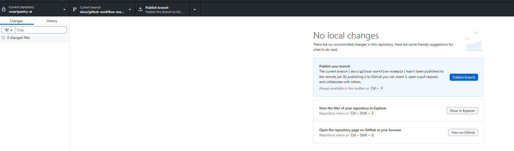

Seeing **Publish branch** is normal. It does not mean something is wrong.

> 💡 **Local branch = exists on your computer. Remote branch = exists on GitHub.**

For the SmartPantry team workflow, you can publish the branch when you are ready to share or push your work to GitHub.

---

## 4. Make Your Changes and Review Them

Once you have confirmed that you are working on your task branch, you can begin editing, creating, or deleting the files needed for your task.

As you work, GitHub Desktop automatically detects changes made inside the SmartPantry AI repository.

### Check the Changes Panel

Open GitHub Desktop and look at the **Changes** tab on the left.

Files that you have added, modified, or deleted will appear here.

Click a changed file to review exactly what was changed.

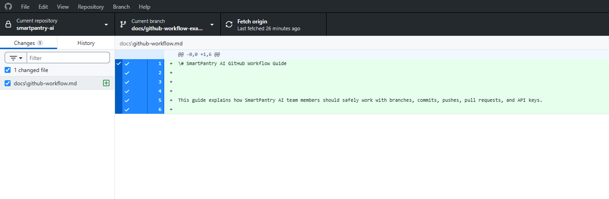

### 🔐 Security Check Before Every Commit

Before committing, review the entire list of changed files.

Make sure:

- Every changed file belongs to your task.
- No `.env` file containing real API keys appears.
- No passwords, tokens, or other secrets appear in the changes.
- No unrelated or accidental files are included.
- The changes shown are what you intended to make.

> 🚨 **If you see a `.env` file, API key, password, token, or other secret, STOP. Do not commit or push the changes.**

### What If a New Folder Does Not Appear?

Git tracks files, not empty folders.

If you create a new folder and GitHub Desktop still shows **0 changed files**, the folder may simply be empty.

Once you add a file inside the folder, GitHub Desktop can detect and track it.

> 💡 **An empty folder existing in File Explorer does not necessarily mean Git is tracking it.**

---

## 5. Commit Your Changes

After reviewing your changed files and completing the security check, you are ready to commit your work.

A **commit** saves a snapshot of your changes to your current branch on your computer.

### Step 1: Write a Commit Message

At the bottom-left of GitHub Desktop, enter a short, descriptive message in the **Summary** box.

Good examples:

- `Add recipe recommendation logic`
- `Add barcode lookup module`
- `Update expiration tracking`
- `Fix recipe scoring calculation`
- `Update GitHub workflow guide`

Avoid vague messages such as:

- `stuff`
- `changes`
- `update`
- `fix`

Your teammates should be able to understand what the commit does by reading the message.

### Step 2: Commit to Your Branch

Before clicking the commit button, check the branch name shown on the button.

It should say:

**Commit to YOUR-BRANCH-NAME**

It should NOT say:

**Commit to main**

Then click the commit button.

### What Happens After a Commit?

After the commit succeeds, GitHub Desktop may show **0 changed files** and a **Push origin** button.

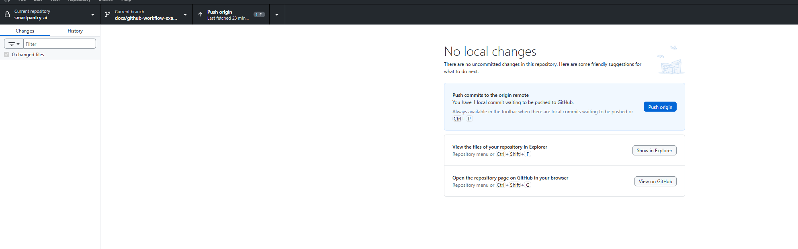

This means your changes have been committed on your computer, but the new commit has not been uploaded to GitHub yet.

> 💡 **Commit = Save the changes to your branch locally. Push = Send those committed changes to GitHub.**

> ⚠️ **Seeing 0 changed files after committing does not mean your work disappeared. It means the changes are now stored inside the commit.**

---

## 6. Push Your Work to GitHub

After committing your changes, the commit exists on your computer but may not yet exist on GitHub.

To upload the commit to GitHub, click **Push origin**.

### Before the Push

If GitHub Desktop shows **Push origin**, you have one or more local commits waiting to be uploaded.

### After the Push

Once the push finishes successfully:

- **Push origin** should disappear.
- GitHub Desktop may return to **Fetch origin**.
- You should still see **0 changed files** if you have not made additional changes.
- GitHub Desktop may offer **Preview Pull Request**.

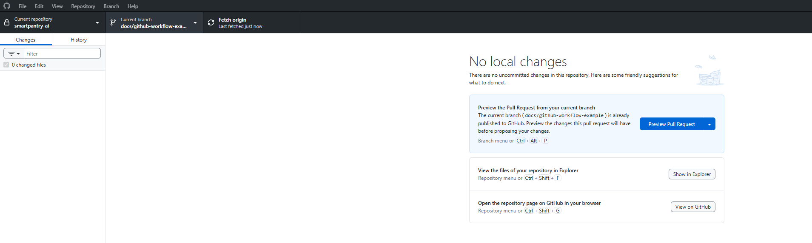

Your committed work now exists on GitHub as part of your task branch.

> 💡 **Push does NOT put your changes into `main`. It only uploads your task branch and its commits to GitHub.**

The next step is to create a **Pull Request** asking for those changes to be reviewed and merged into `main`.

---

## 7. Create a Pull Request

After pushing your task branch to GitHub, create a **Pull Request (PR)**.

A Pull Request asks the team to review your branch before its changes are merged into `main`.

### Step 1: Preview the Pull Request

In GitHub Desktop, click **Preview Pull Request**.

Before continuing, verify:

- **Base branch:** `main`
- **From:** your current task branch
- The files and changes shown are the changes you expect.

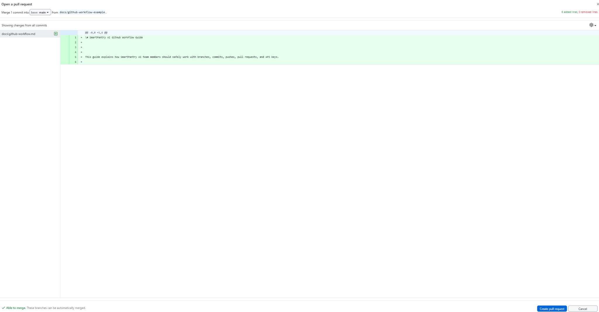

> ⚠️ **Check the branches carefully. Your task branch should be merging INTO `main`, not the other way around.**

If everything looks correct, click **Create pull request**.

### Step 2: Complete the Pull Request on GitHub

GitHub will open the Pull Request page in your browser.

Before creating the PR, verify again:

- **base:** `main`
- **compare:** your task branch
- GitHub shows **Able to merge**
- The title clearly describes your work.
- The description briefly explains what you changed.
- The commits and changed files are what you expect.

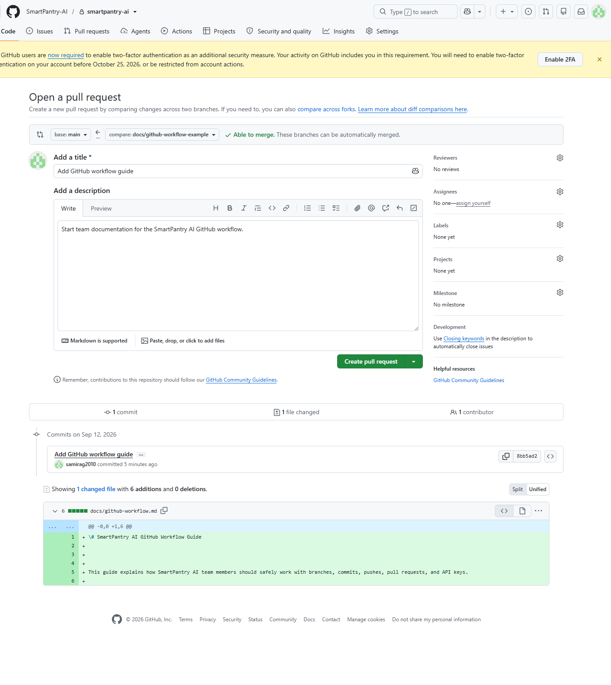

Then click the green **Create pull request** button.

### Step 3: Confirm the Pull Request Is Open

After creating it, GitHub will display the Pull Request.

You should see:

- **Open**
- Your task branch merging into `main`
- The Pull Request title and description
- Tabs for **Commits**, **Checks**, and **Files changed**

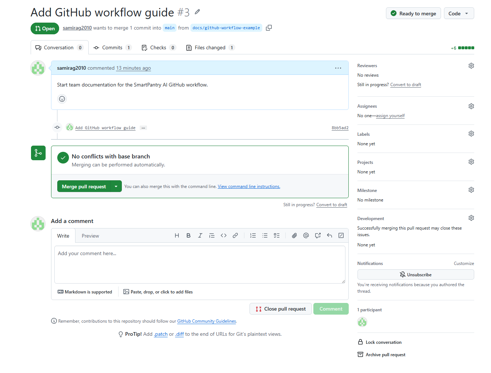

> 🛑 **Do not merge yet. Review the Pull Request and its changed files first.**

---

## 8. Review the Pull Request Before Merging

Before merging a Pull Request into `main`, review the proposed changes.

### Step 1: Open `Files changed`

On the Pull Request page, click the **Files changed** tab.

This shows exactly what the branch is proposing to add, modify, or delete from `main`.

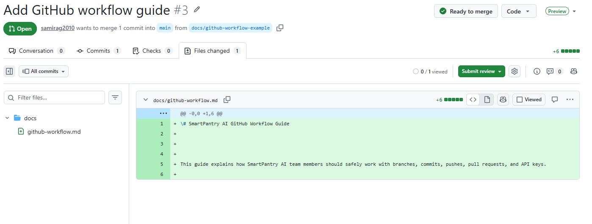

### Step 2: Review the Changes

Check that:

- The files belong to the task described in the Pull Request.
- The code or documentation changes look correct.
- No unexpected files were added or deleted.
- No unfinished test code or accidental changes are included.
- The Pull Request does not contain secrets.

### 🔐 Security Check Before Merge

Look carefully for:

- API keys
- Passwords
- Access tokens
- Real `.env` files
- Private credentials
- Other sensitive information

> 🚨 **If a secret appears anywhere in the Pull Request, DO NOT MERGE IT.**

If a real secret was already pushed to GitHub, removing the visible line alone may not be enough because Git can preserve it in commit history.

Follow the **Security First: API Keys & Secrets** instructions at the top of this guide.

> ✅ **Only move to the merge step after reviewing the Pull Request and confirming the changes are safe and correct.**

---

## 9. Merge the Pull Request

Once the Pull Request has been reviewed and the changes are safe and correct, it can be merged into `main`.

### Step 1: Click `Merge pull request`

Return to the **Conversation** tab of the Pull Request.

Make sure GitHub shows that the Pull Request can be merged without conflicts.

Click **Merge pull request**.

### Step 2: Confirm the Merge

GitHub will give you one final confirmation screen.

Review the merge information one last time, then click **Confirm merge**.

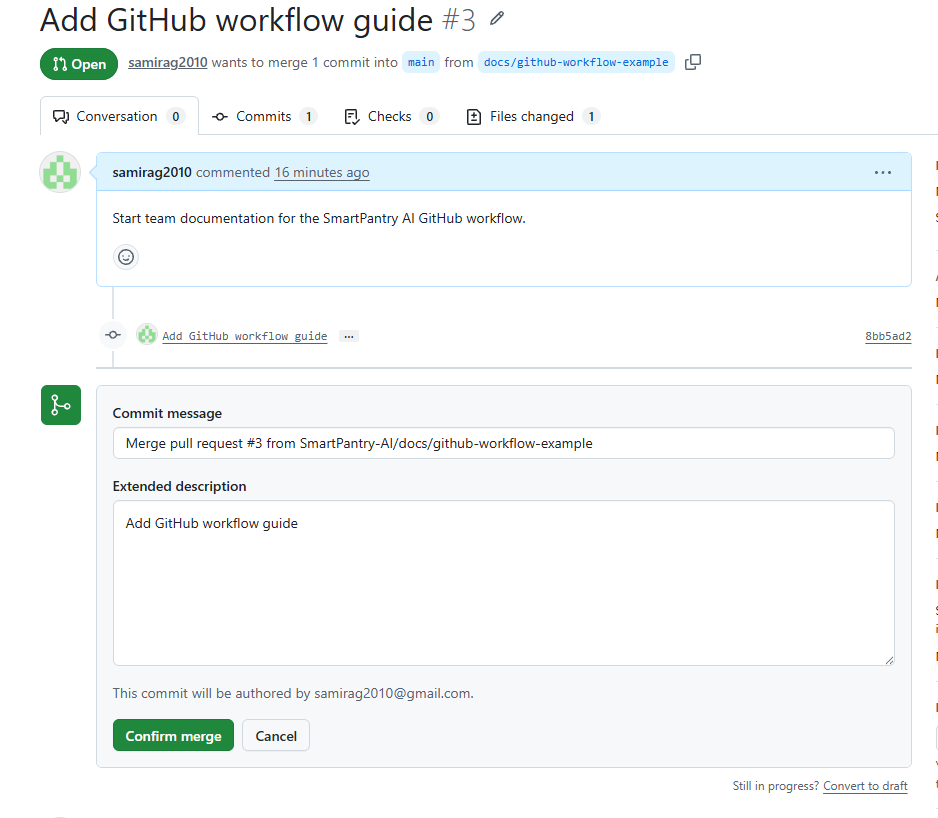

> ⚠️ **This is the final checkpoint. Once you confirm the merge, the Pull Request changes become part of `main`.**

### Step 3: Confirm the Pull Request Was Merged

After the merge completes, GitHub should display:

**Pull request successfully merged and closed**

You should also see a purple **Merged** status.

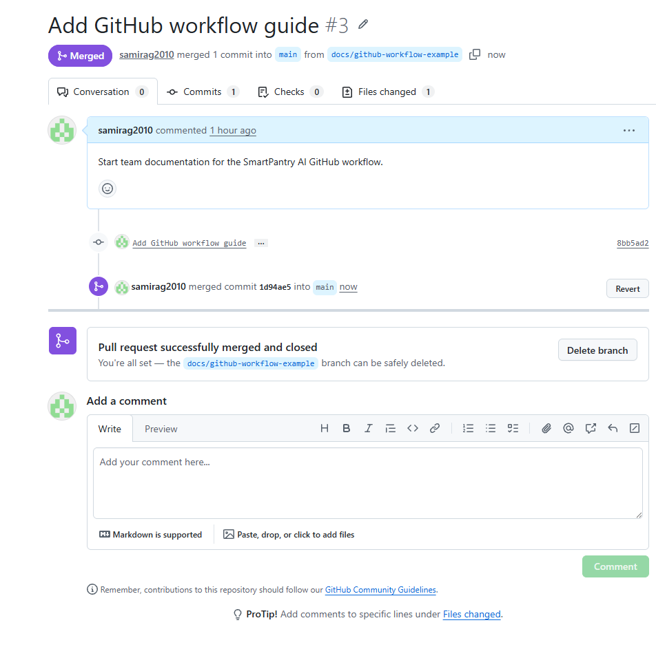

At this point, your changes are now part of `main`.

GitHub may also tell you that your task branch can be safely deleted.

> 💡 **Merging does not mean you should immediately start your next task. Clean up the completed branch and synchronize `main` first.**

---

## 10. Delete the Finished Branch

After your Pull Request has been successfully merged into `main`, the completed task branch can usually be deleted.

Deleting finished branches keeps the repository organized and makes it easier to see which work is still active.

### Step 1: Delete the Branch on GitHub

After a successful merge, GitHub may display a **Delete branch** button.

Only delete the branch after you have confirmed that the Pull Request was successfully merged.

### Step 2: Return to `main` in GitHub Desktop

Open GitHub Desktop and switch your **Current branch** back to `main`.

You may still see your completed branch under **Recent branches**.

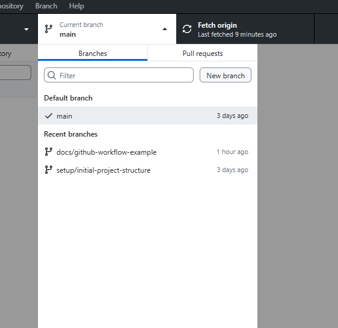

This is normal. A branch can exist on your computer even after its work has been merged.

### Local Branch vs. Remote Branch

There are two copies of a branch you may encounter:

- **Local branch:** The branch stored on your computer.
- **Remote branch:** The branch stored on GitHub.

If a branch still exists both locally and on GitHub, GitHub Desktop may ask whether you also want to delete the branch from the remote.

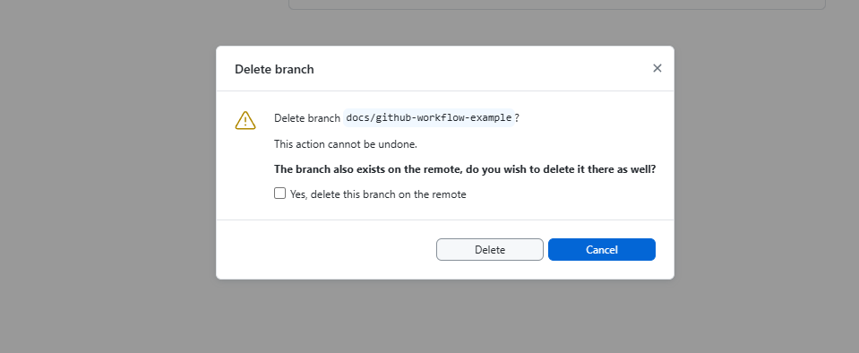

If the branch exists only on your computer, the delete window will not show the remote option.

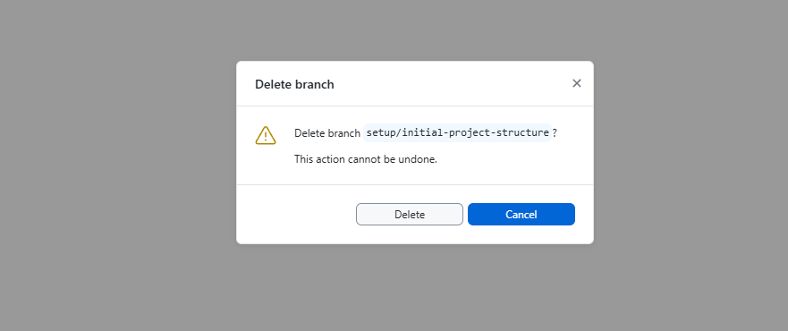

### What If You See `Publish branch` on an Old Branch?

If an old completed branch shows **Publish branch**, that means the branch currently exists locally but does not exist on GitHub.

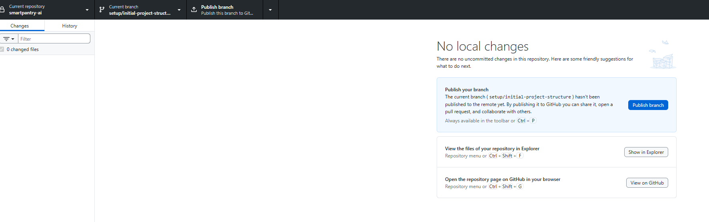

If its work has already been successfully merged into `main`, do not publish the old branch again just because the **Publish branch** button appears.

> ⚠️ **Before deleting any branch, confirm that its Pull Request was successfully merged and that the work exists in `main`.**

---

## 11. Return to `main` and Sync

After the Pull Request has been merged and the completed branch has been cleaned up, return to `main`.

### Step 1: Switch Back to `main`

In GitHub Desktop:

1. Click **Current branch**.
2. Select `main`.
3. Confirm that **Current branch** now displays `main`.

### Step 2: Fetch the Latest Changes

Click **Fetch origin**.

Remember that the Pull Request was merged on GitHub, so your local copy of `main` may still need the newly merged changes.

If **Pull origin** appears after fetching, click **Pull origin**.

This brings the newly merged work into the copy of `main` on your computer.

### Step 3: Confirm a Clean Repository

When everything is synchronized, you should normally see:

- Current repository: `smartpantry-ai`
- Current branch: `main`
- **0 changed files**
- **Fetch origin**
- **No local changes**

### ✅ Workflow Complete

You have now completed the full SmartPantry AI GitHub workflow:

**Sync `main` → Create branch → Make changes → Review → Commit → Push → Pull Request → Review → Merge → Delete branch → Return to `main` → Sync**

Your computer is now ready for the next task.

> 💡 **For every new task, start this workflow again from an updated `main`.**

---

## 12. Continue Work on Another Computer

You may sometimes start work on one computer and continue it on another.

The most important rule is:

> ⚠️ **Commit and Push your work before leaving the first computer.**

If your work only exists as an uncommitted change or local commit, the second computer will not have it.

### On Computer 1

Before switching computers:

1. Review your changed files.
2. Commit your changes to your task branch.
3. Click **Push origin**.
4. Make sure the push completes successfully.

Your latest work is now stored on GitHub.

### On Computer 2

Open GitHub Desktop and:

1. Select the `smartpantry-ai` repository.
2. Click **Fetch origin**.
3. Open **Current branch**.
4. Select the same task branch you were using on Computer 1.
5. If **Pull origin** appears, click it.
6. Confirm you are on the correct branch before editing files.

You can now continue working from where you stopped.

### Before Switching Back Again

Repeat the same process:

**Review → Commit → Push**

Then Fetch/Pull the branch on the other computer before continuing.

> 💡 **Think of GitHub as the bridge between the two computers. Commit prepares your work, Push sends it to GitHub, and Pull brings it onto the other computer.**

> 🚨 **Never assume your latest work is on the other computer until you have successfully pushed it to GitHub.**

---

# 🧰 Troubleshooting

Use this section when GitHub Desktop does not look the way you expect.

## `Fetch origin` Does Not Change to `Pull origin`

This is usually normal.

**Fetch origin** checks GitHub for updates.

If GitHub Desktop continues to show **Fetch origin** after checking, there may simply be nothing new to download.

If remote changes are available, GitHub Desktop may show **Pull origin**.

---

## My New Folder Is Not Showing in GitHub Desktop

Git does not track empty folders.

You may create a folder in File Explorer and still see **0 changed files** in GitHub Desktop.

Add an actual file inside the folder and GitHub Desktop should detect the change.

This is what happened when the `docs` folder was first created for this guide.

---

## I See `Publish branch`

**Publish branch** means the branch currently exists on your computer but has not yet been uploaded to GitHub.

This is normal for a newly created local branch.

Before publishing, make sure you are on the correct task branch.

If this is an old branch whose work has already been merged, verify that the work exists in `main` before deciding whether the old local branch should simply be deleted.

---

## I See `Push origin`

**Push origin** means you have one or more commits on your computer that have not yet been uploaded to GitHub.

Click **Push origin** when you are ready to send those commits to GitHub.

Remember:

**Commit = Save locally**

**Push = Upload committed work to GitHub**

---

## I See `Pull origin`

**Pull origin** means GitHub contains changes that your computer does not have yet.

If you are preparing to start new work from `main`, pull those changes before creating your task branch.

---

## GitHub Desktop Shows `0 changed files` After I Commit

This is normal.

Once changes are committed, they are stored inside the commit and are no longer considered uncommitted changes.

Look for **Push origin** to determine whether the commit still needs to be uploaded to GitHub.

---

## My Python File Accidentally Became a `.txt` File

Windows may hide known file extensions.

This can cause a file that appears to be:

`__init__.py`

to actually be:

`__init__.py.txt`

To check this in Windows File Explorer:

1. Open **View**.
2. Select **Show**.
3. Enable **File name extensions**.

You should then be able to see the complete filename.

---

## I Still See a Branch After It Was Merged

This can be normal.

A remote branch on GitHub and a local branch on your computer are separate.

Deleting the GitHub branch does not always remove the local branch from GitHub Desktop.

Before deleting the remaining local branch, confirm that its Pull Request was successfully merged into `main`.

---

## Something Still Does Not Look Right

Do not guess, force a merge, delete files, or publish an old branch just to make the warning disappear.

Stop and check:

- Which repository am I in?
- Which branch am I on?
- Do I have changed files?
- Do I need to Fetch, Pull, Push, or Publish?
- Has my Pull Request already been merged?
- Could any secret or API key be involved?

> 🛑 **If you are unsure, stop before committing, pushing, merging, or deleting and ask the team.**

---

# ✅ SmartPantry Team Quick Checklist

Use this checklist for everyday work after you are familiar with the full instructions above.

### Before Starting Work

- [ ] Open the `smartpantry-ai` repository.
- [ ] Switch to `main`.
- [ ] Click **Fetch origin**.
- [ ] Click **Pull origin** if it appears.
- [ ] Confirm `main` is up to date.
- [ ] Create or switch to your task branch.
- [ ] Confirm you are NOT working directly on `main`.

### Before Every Commit

- [ ] Review every changed file.
- [ ] Confirm the changes belong to your task.
- [ ] Check for accidental or unrelated files.
- [ ] Make sure no `.env` file is included.
- [ ] Make sure no API keys, passwords, tokens, or secrets appear.
- [ ] Write a clear commit message.
- [ ] Confirm the commit is going to your task branch, NOT `main`.

### Before Creating a Pull Request

- [ ] Push your latest commits to GitHub.
- [ ] Confirm the base branch is `main`.
- [ ] Confirm the compare branch is your task branch.
- [ ] Review the files and changes.
- [ ] Add a clear Pull Request title and description.

### Before Merging

- [ ] Review **Files changed**.
- [ ] Confirm no secrets or sensitive information appear.
- [ ] Confirm the changes are complete and correct.
- [ ] Confirm the Pull Request is merging your task branch INTO `main`.

### After Merging

- [ ] Confirm GitHub says the Pull Request was successfully merged.
- [ ] Delete the completed task branch when it is safe to do so.
- [ ] Return to `main` in GitHub Desktop.
- [ ] Click **Fetch origin**.
- [ ] Click **Pull origin** if it appears.
- [ ] Confirm `main` shows **0 changed files**.

> 🔐 **Security Rule: Never commit or push API keys, passwords, tokens, `.env` files containing secrets, or other private credentials.**

> 🌿 **Golden Rule: Never do project work directly on `main`.**

---

# 🎯 SmartPantry AI GitHub Workflow

**Start on updated `main` → Create a task branch → Make changes → Review → Commit → Push → Create Pull Request → Review → Merge → Delete completed branch → Return to `main` → Sync**

If your screen does not match what you expect, stop and use the **Troubleshooting** section before continuing.